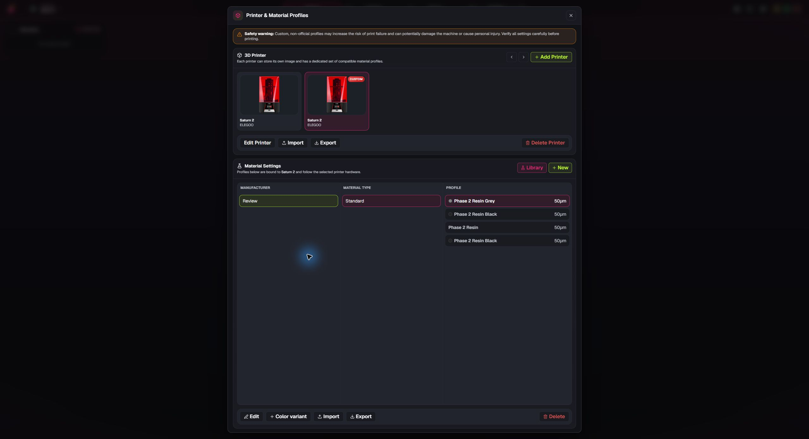
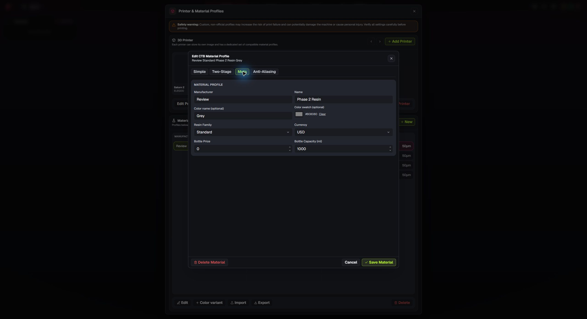
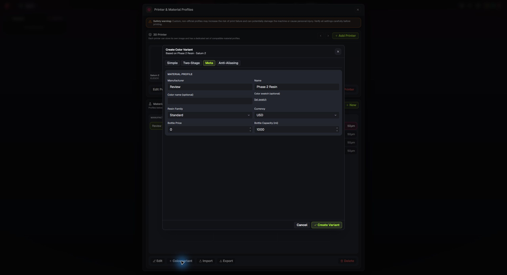

# Phase 0.2 review screenshots

These screenshots show the Phase 0.2 material color and variant workflow in a Windows review build. The test materials are independent Grey and Black profiles. Phase 0.2 is awaiting user acceptance; this review build does not change the app version or create a release.

Independent Grey and Black test profiles, each with its own print settings.

Optional color name and swatch controls in the Meta tab.

Create Color Variant copies print settings into a separate profile. Cancel closes the dialog without creating a profile.
