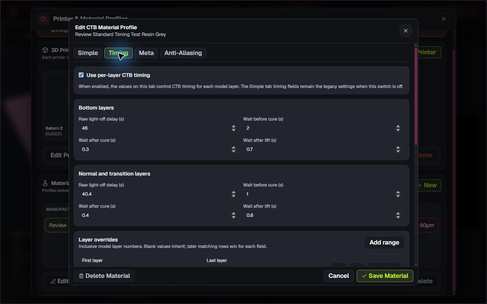
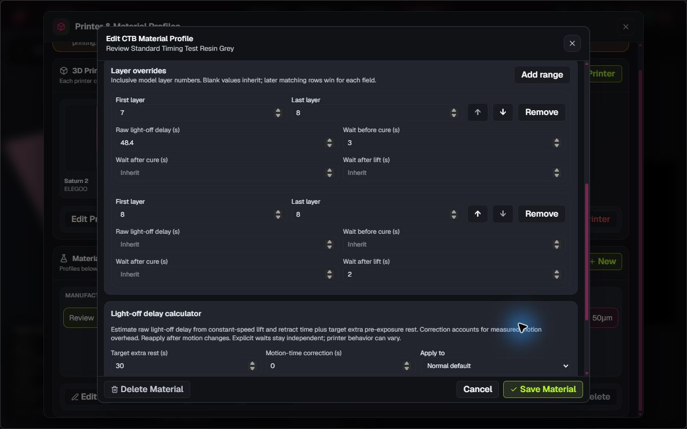
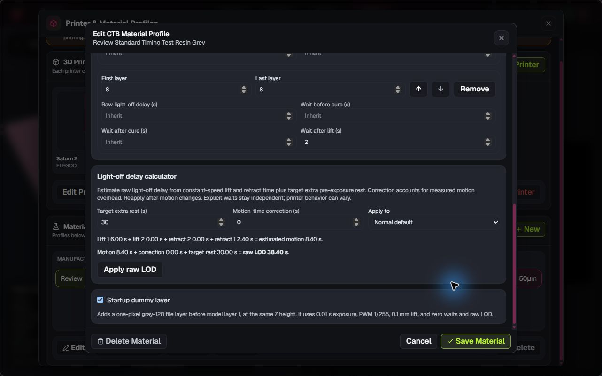
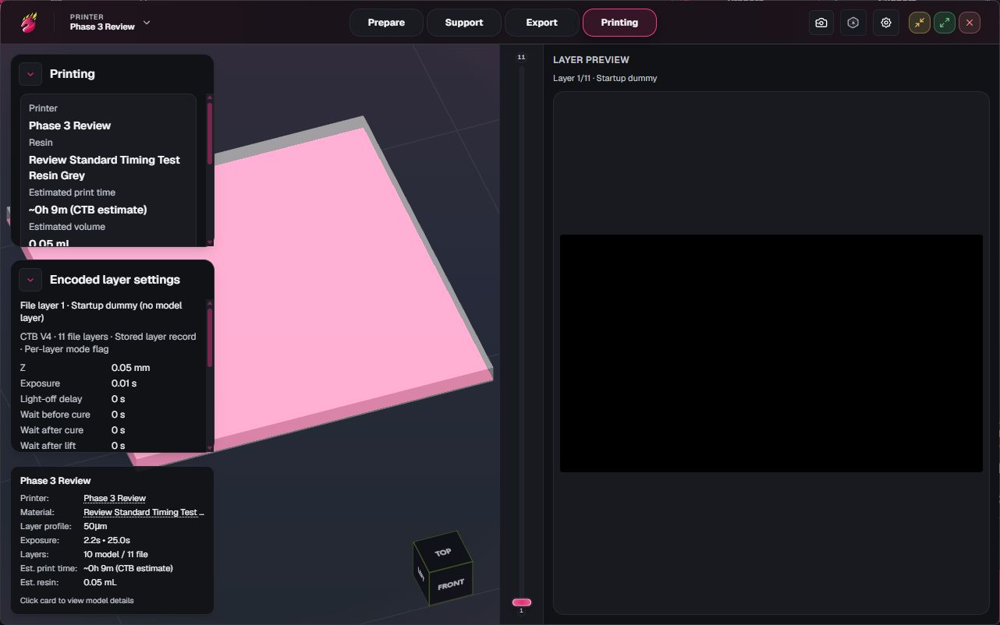
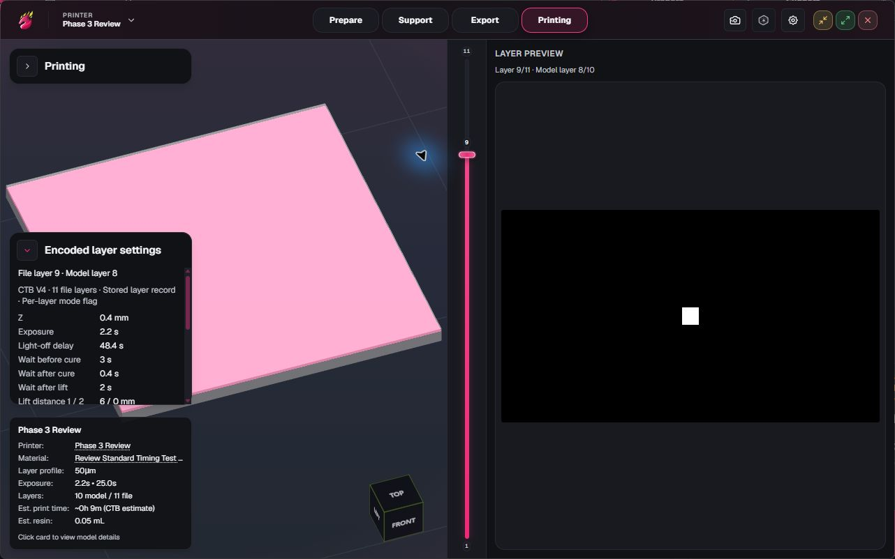

# Phase 0.3 screenshots

These screenshots show synthetic review profiles; physical printer timing has not been verified, and Phase 0.3 awaits user acceptance.

## Timing defaults

Independent bottom and normal timing controls for raw light-off delay and the three wait values.

## Layer range controls

Inclusive range and individual-layer overrides can set selected timing fields while blank fields inherit their defaults.

## Light-off delay calculator

Target extra rest, motion-time correction, travel breakdown, and the calculated raw light-off delay before Apply.

## Startup dummy preview

The left-aligned file-layer inspector above the printer and material stats card identifies the startup dummy separately from the first real model layer.

## Layer override preview

The left-aligned per-layer inspector above the printer and material stats card shows resolved timing for an individual or range override.

