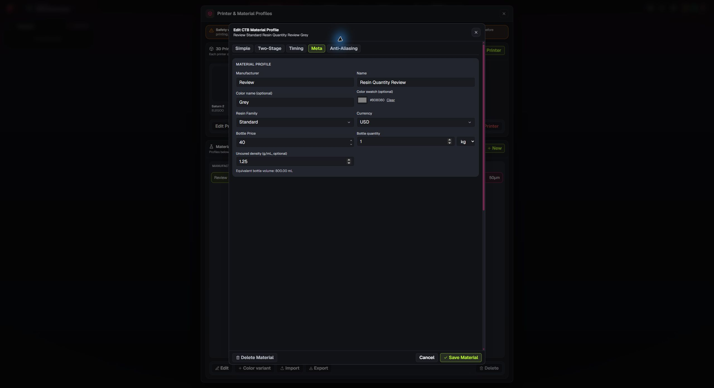
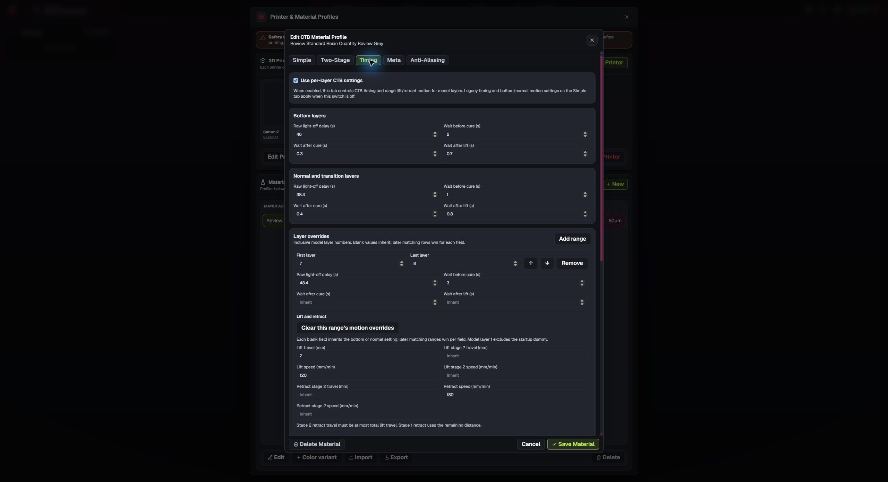
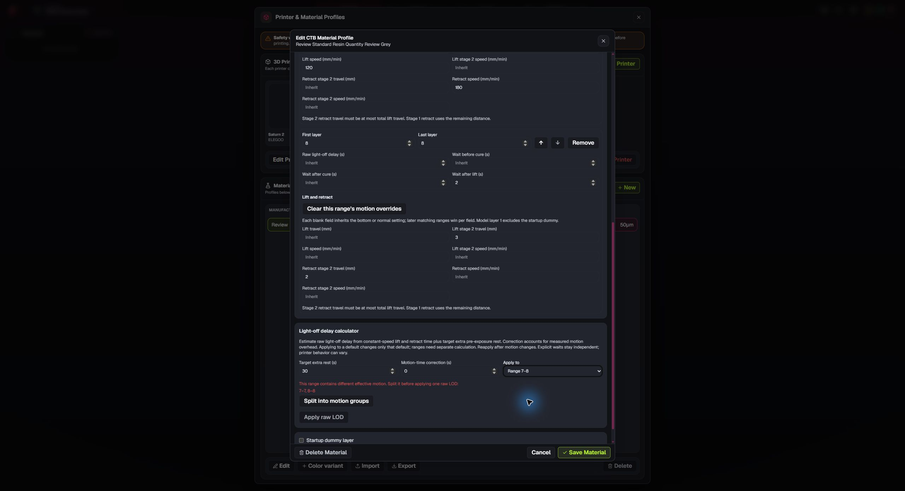
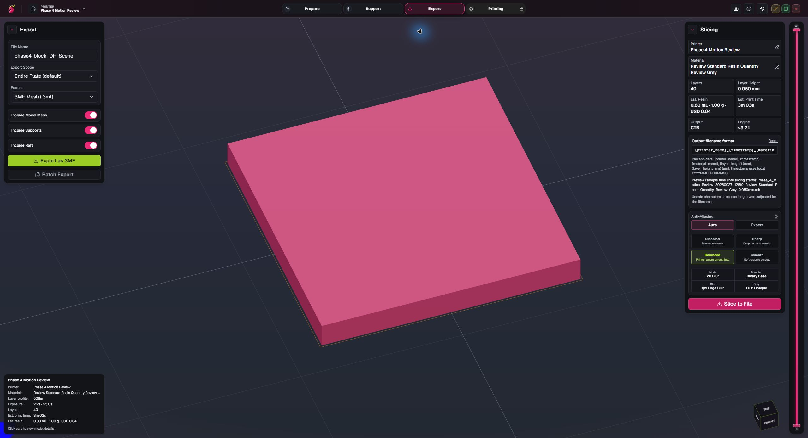
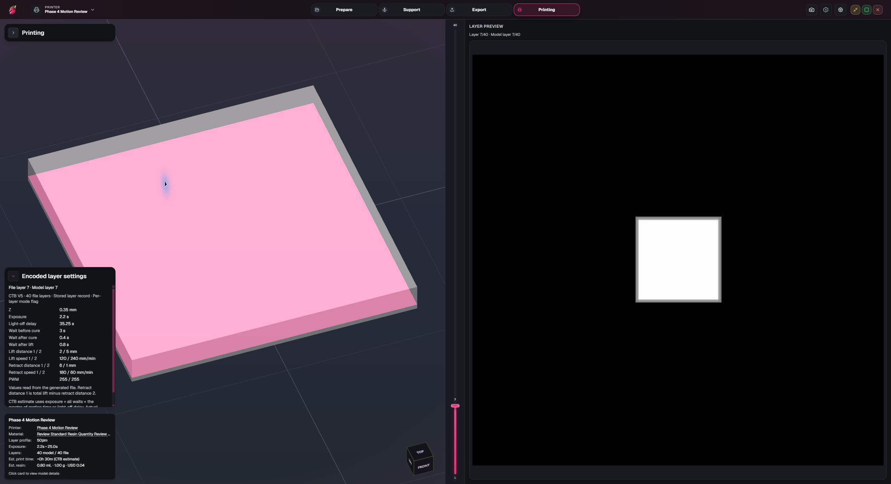

# Phase 0.4 screenshots

These screenshots use a synthetic printer and material fixture in the native Windows app. The fixture's capability declaration is test data; it does not confirm per-layer motion on a physical printer or any real firmware. See [Phase 0.4 acceptance](phase-4-acceptance.md) for checks performed and remaining coverage.

## Resin weight and density

A 1 kg bottle with uncured density of 1.25 g/mL displays an 800 mL equivalent volume.

## Layer motion overrides

The Timing tab shows overlapping model-layer ranges and optional Two Stage lift/retract fields. Blank fields inherit independently.

## Mixed-motion calculator

The LOD calculator blocks one Apply across a range with different effective motion and offers homogeneous ranges for separate calculation.

## Resin estimate

The 20 × 20 × 2 mm test model displays 0.8 mL, 1 g, and $0.04 using the synthetic material profile.

## Encoded layer 7

After an encrypted CTB V5 export, the file-backed inspector shows layer 7's applied 35.25 s raw LOD and its encoded lift/retract motion. Independent UVtools decoding of the app-produced file is recorded in the acceptance evidence.

