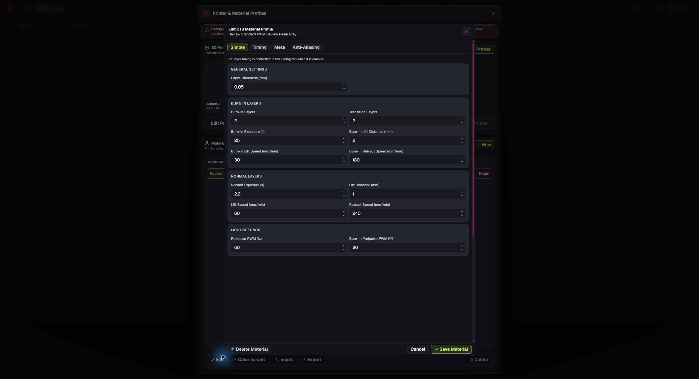
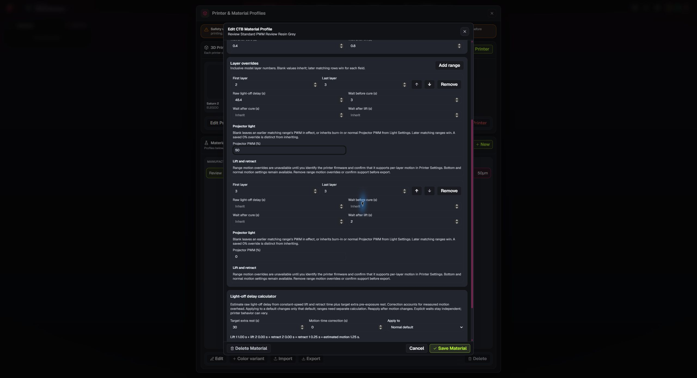
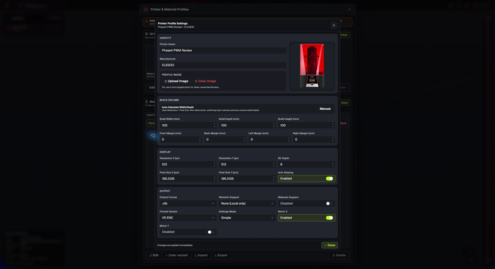
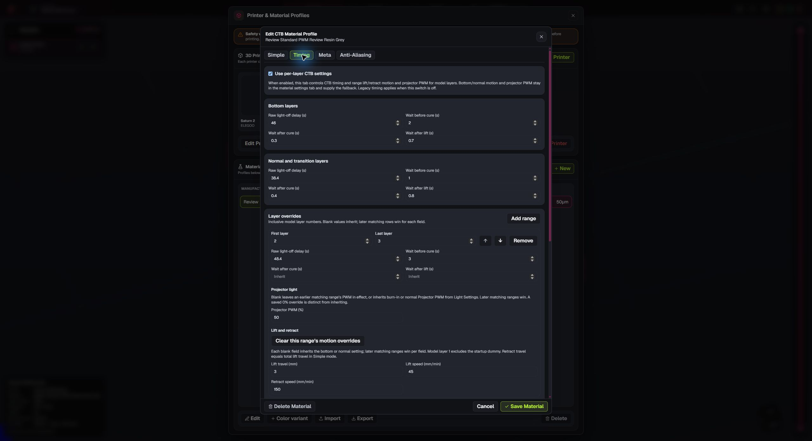
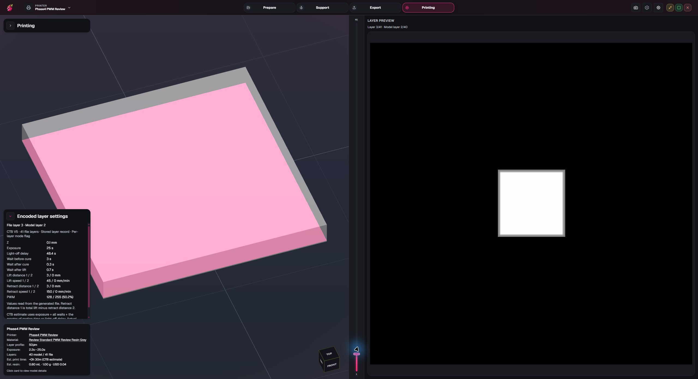

# Phase 0.4 screenshots

These screenshots use synthetic printer and material fixtures in the native Windows app. The earlier motion screenshots were captured before removal of the firmware gate; their fixture's capability declaration was test data. None of the screenshots confirms behavior on a physical printer or any real firmware. See [Phase 0.4 acceptance](phase-4-acceptance.md) for checks performed and remaining coverage.

## Resin weight and density

A 1 kg bottle with uncured density of 1.25 g/mL displays an 800 mL equivalent volume.

## Layer motion overrides

The Timing tab shows overlapping model-layer ranges and optional Two Stage lift/retract fields. Blank fields inherit independently.

## Mixed-motion calculator

The LOD calculator blocks one Apply across a range with different effective motion and offers homogeneous ranges for separate calculation.

## Resin estimate

The 20 × 20 × 2 mm test model displays 0.8 mL, 1 g, and $0.04 using the synthetic material profile.

## Encoded layer 7

After an encrypted CTB V5 export, the file-backed inspector shows layer 7's applied 35.25 s raw LOD and its encoded lift/retract motion. Independent UVtools decoding of the app-produced file is recorded in the acceptance evidence.

## Simple CTB PWM defaults

The synthetic Simple CTB V5 encrypted profile shows separate normal 60% and bottom 80% PWM controls.

## PWM layer ranges

The Timing tab shows a 50% override for model layers 2–3 and an overlapping 0% override for layer 3.

## Encoded PWM layers

The file-backed inspector screenshot shows model layer 2 at PWM 128/255 (50.2%) in the native app. The same review also showed the startup dummy at 1/255 (0.4%) and model layer 3 at 0/255 (0.0%). UVtools independently decoded the app-produced file as recorded in the acceptance evidence.

## Range motion without firmware controls

The current Printer Output panel has no firmware identification or confirmation section.

In the Timing tab, a Simple CTB V5 encrypted profile with no capability metadata shows range motion values for model layers 2–3: 3 mm lift, 45 mm/min lift speed, and 150 mm/min retract speed. The app exported these values in a CTB file; the independent decode is recorded in the acceptance evidence.

The file-backed inspector for the app-produced CTB shows file layer 3/model layer 2 with 3/0 mm lift, 45/0 mm/min lift speed, 3/0 mm retract, 150/0 mm/min retract speed, and PWM 128/255.

